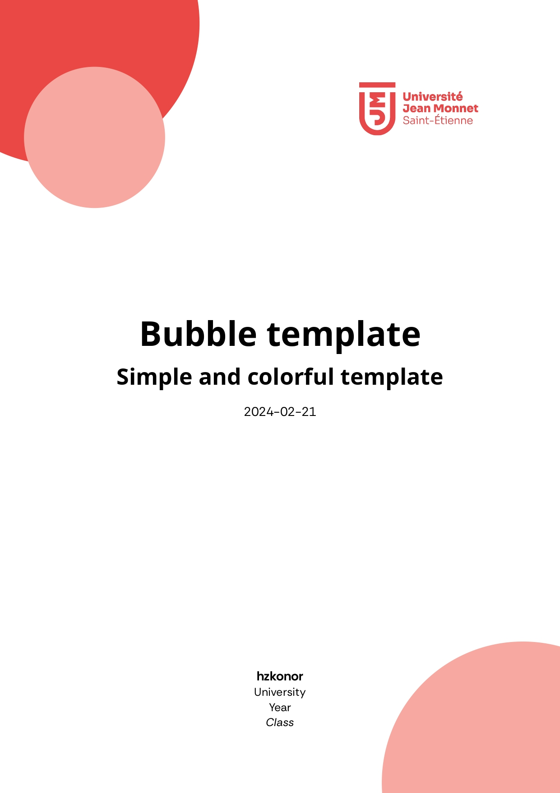
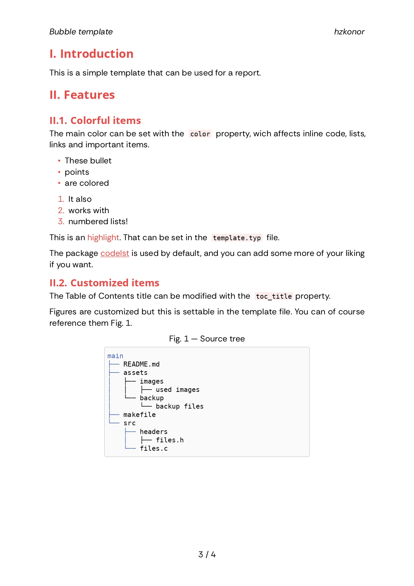
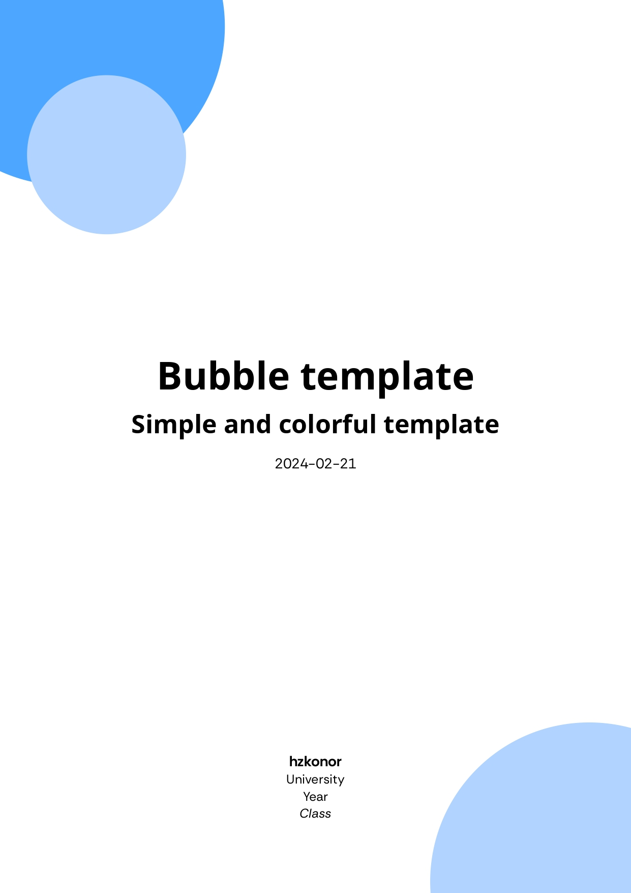
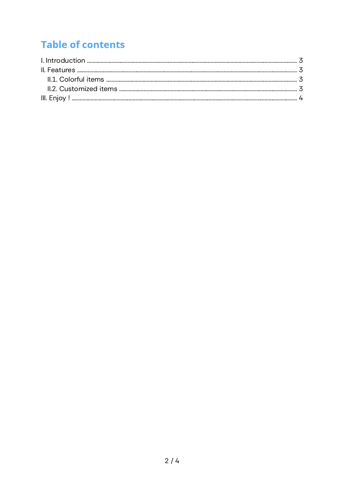
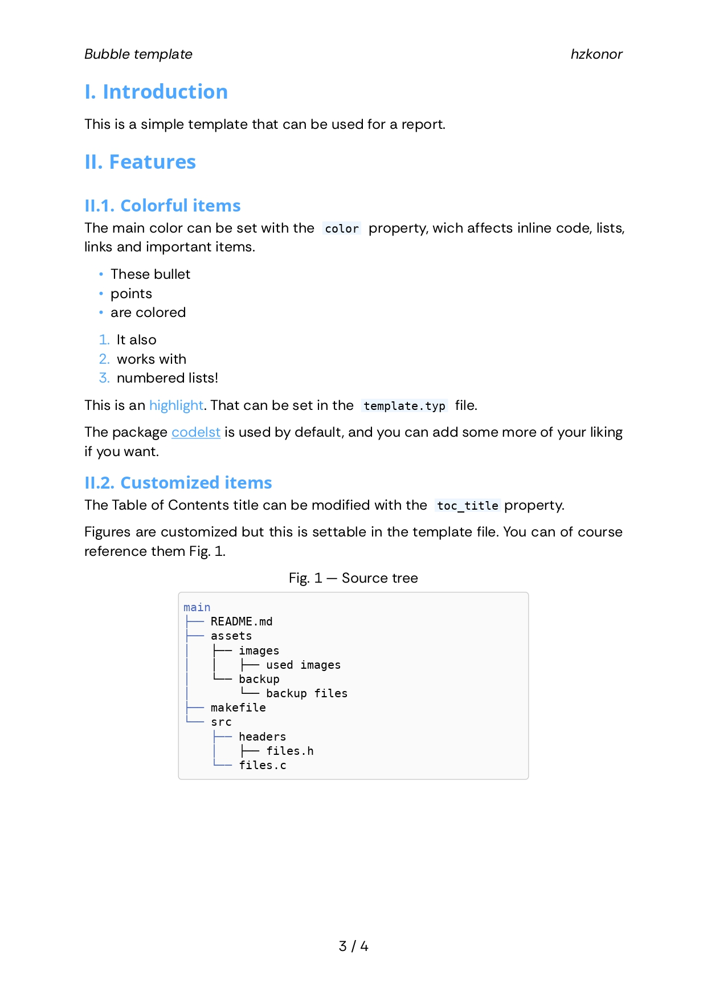

# Bubble template

Simple and colorful template for [typst](https://typst.app).

## Features

You can select a main color (default is `#E94845`) which is coloring :

- list items
- links
- hightlighted words (settable in the template file)
- inline blocks
- headings

You can set a custom table of content title without leaving your main file with `toc_title` property.

Every page is numbered and has the title of the document and the name of the author at the top.

## Examples
### Default color

| Main page | TOC | List of features | Page |
| -- | -- | -- | -- |
|  |  |  |  |

### Other color

Here, `#4DA6FF`

| Main page | TOC | List of features | Page |
| -- | -- | -- | -- |
|  |  |  |  |