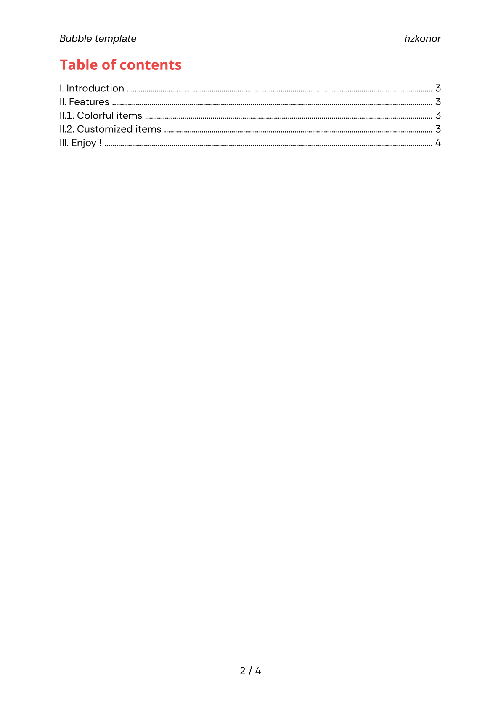
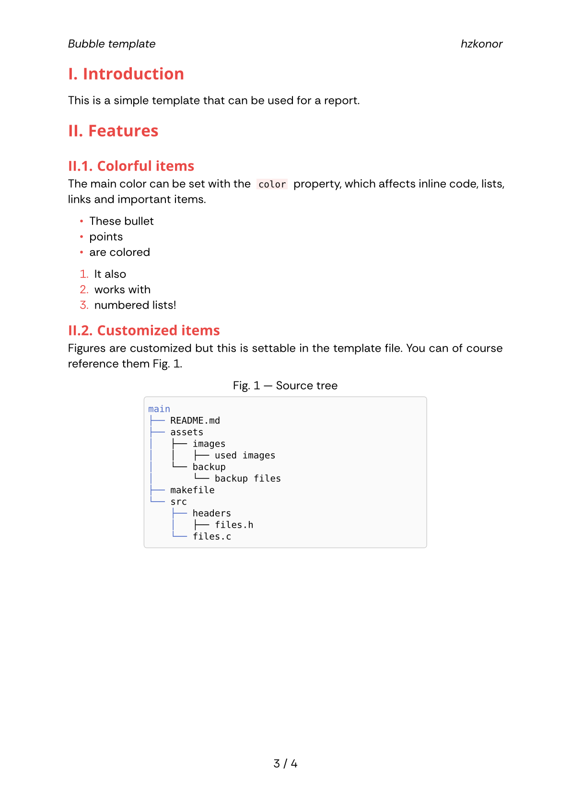
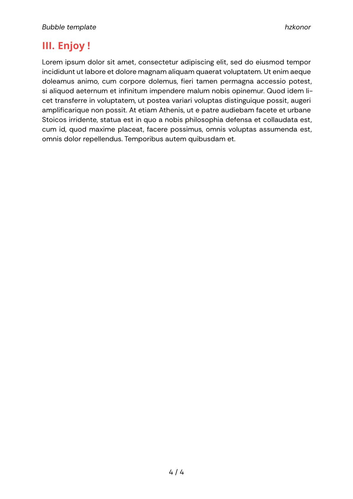
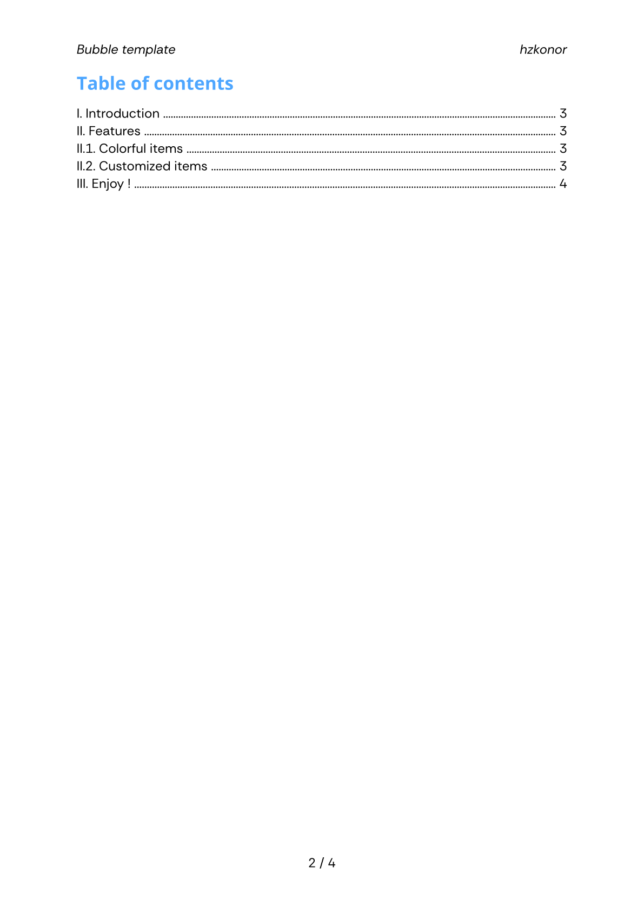
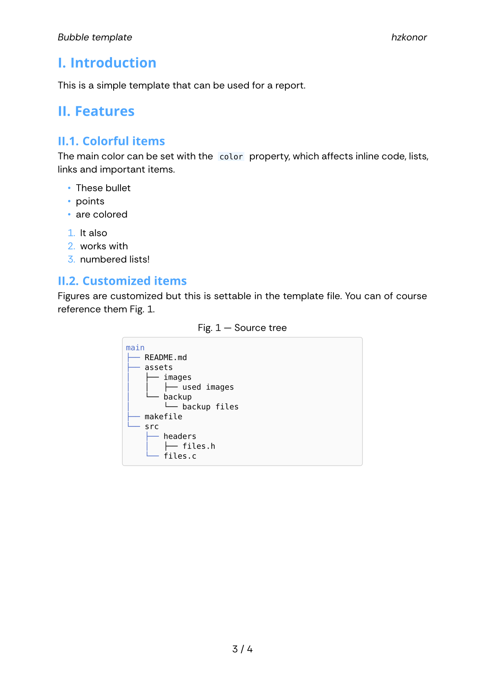
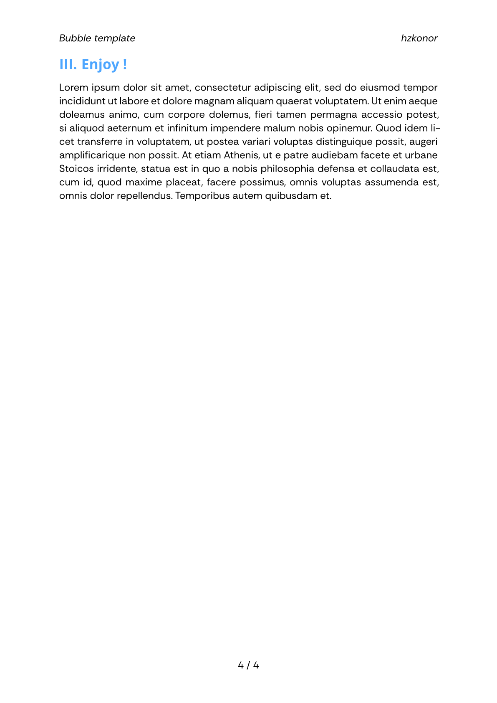

# Bubble template

Simple and colorful template for [Typst](https://typst.app). 

Also available as a [package](https://typst.app/universe/package/bubble).

This template includes the package [codelst](https://github.com/jneug/typst-codelst), and you can add others if you want.

## Features

You can select a main color (default is `#E94845`) which is coloring :

- list items
- links
- inline blocks
- headings
- words in the `color-words` array

Every page is numbered and has the title of the document and the name of the author at the top.

## Examples

You can find an example Typst file [here](https://github.com/hzkonor/bubble-template/blob/main/main.typ) and the corresponding [pdf](https://github.com/hzkonor/bubble-template/blob/main/main.pdf)

### Default color

| Main page | TOC | List of features | Page |
| -- | -- | -- | -- |
|  |  |  |  |

### Other color

Here, `#4DA6FF`

| Main page | TOC | List of features | Page |
| -- | -- | -- | -- |
|  |  |  |  |